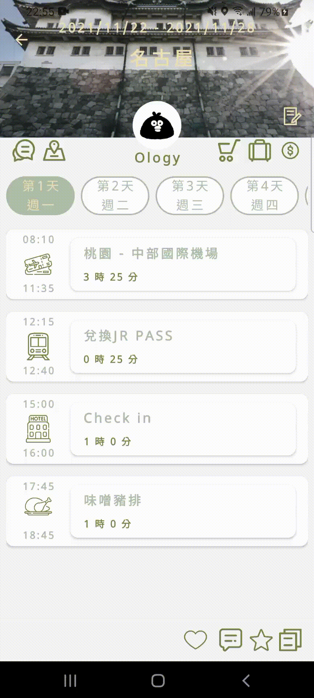
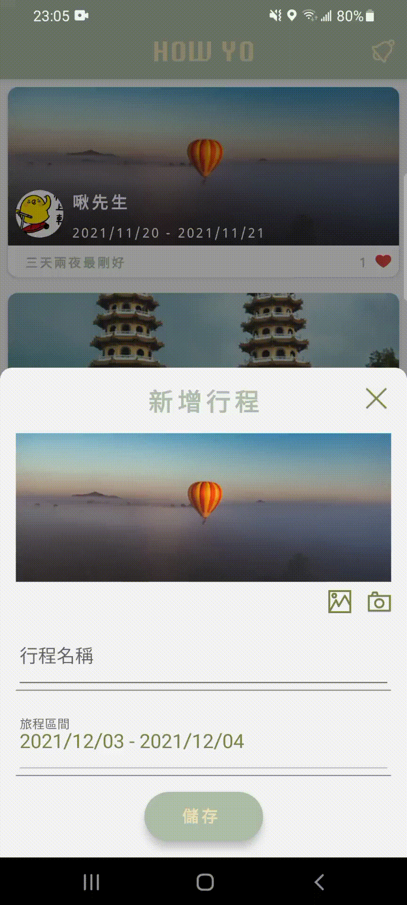
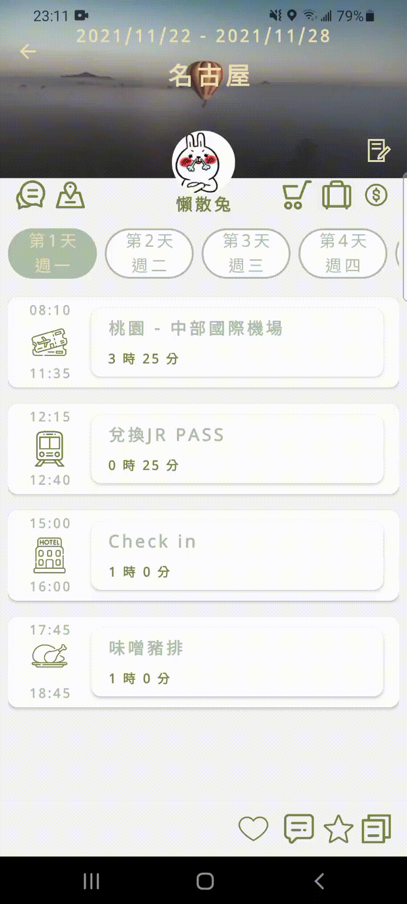
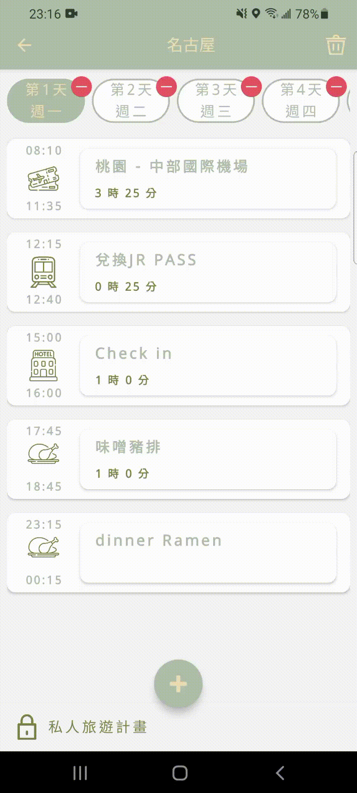
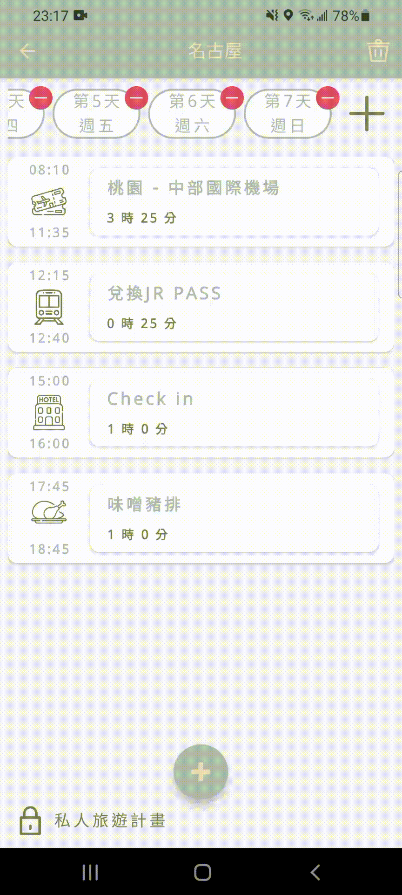
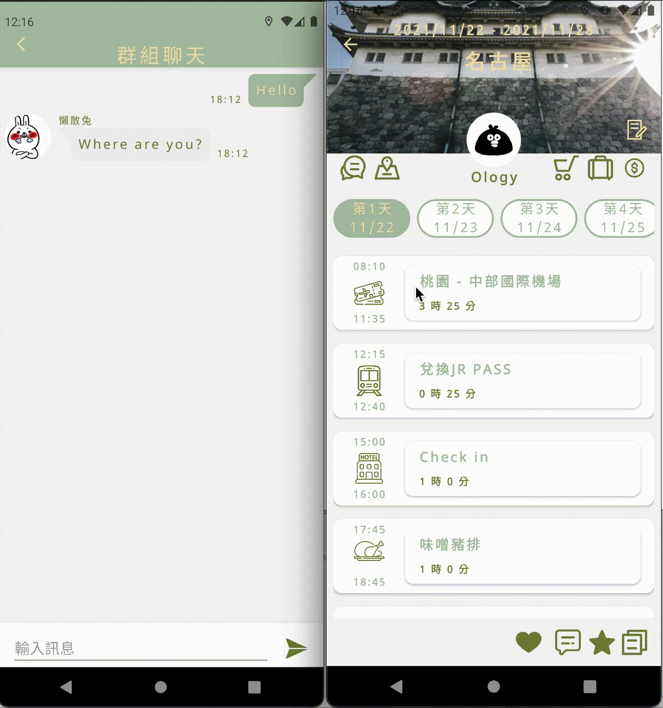

<h1 align="center">How Yo</h1>

A comprehensive App for all travelers, which accompanies everyone from scheduling to the end of the trip.

## Flows 
---
### Test Account
- User:	HowYoGuest@gmail.com / Password: @@HowYo2021

### Planning Flow
The Planning flow is for the user who would like to start a new trip, edit upcoming plan or do the final check before vacation. It includes: 
* Start up the plan
    
    Users could find the plan which is suitable for the reference

    

* Interact with the author of plan
    
    When browsing the plans, users could send a like, leave a comment, collect current plan

    

* Create / Copy plan
    
    Users could copy all contents of the plan from others to a new plan. Besides, they could create a new plan and define the basic information of the trip themselves

    Edit / Reset cover image

    

    Define plan name and duration of traveling

    

    Copy plan from other users

     
    
* Details in the plan
    
    The author could edit the details for the new or existing plan

    Invite friends as the companions

    
    
    Add / Edit schedule in one of days

    
    
    move / delete schedule

    
    
    Add / move / delete days in the plan
    
    

    Co-edit plan with compaions

    
    
    Checking and shopping list

    
    
### Traveling Flow
While users are on the journey, traveling flow provides them to check the schedules, get locations, track their spending, and contact companions with IM.

* Details in schedule
    
    Review the image data

    

    Confirm the location of schedules

    
    
* Get locations
    
    Check companions' current destination

    

* Spending
    
    Track users' spending in the trip, calculate the rate that every members should pay

    
    
* Instant Messaging
    
    The users in the same traveling plan could send message to each other with group message

    

## Techniques
---
* Implement **MVVM** pattern with **LiveData**, **ViewModel**, and **Data Binding**
* Use **CollapsingToolbarLayout** to increase the viewing space of data
* Implement **ItemTouchHelper** for moving and swiping items in **RecyclerView**
* Perform Firebase **Authentication** with Facebook and Google Sign-In to ensure account safety. Provide the one-click sign-in for a better user experience
* Accomplish immediate and co-editable data with **Firestore**
* Build instant messaging by Firestore **Snapshot Listener**
* Upload images to the Firebase **Storage** and store the URL to the associated documents
* Load, present, and cache images from URL by implementing **Glide**
* Get user location data and update it to the database via **Service** in the background continually
* With **Google Maps SDK**, establish the information of location and custom marker icons for displaying avatars from URL
* Initiate **Crashlytics**. Analyze the report of crashing and fix the root cause

## IDE
---
* Android Studio - Arctic Fox
* Android SDK - 26+
* Gradle - 7.0.1

## Release Notes
---

| Version | Data | Description |
| :-----: | ------ | ------ | 
| 1.2 |Nov/21/2021 | Replace displaying user id with user name in every pages |
| 1.2 | Nov/15/2021  |Launch in Goole Play Store |

## Contact
---
Yu Chen ione0213@gmail.com
## License
---
MIT